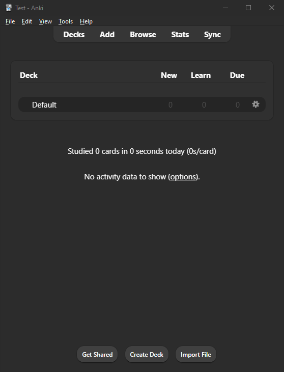
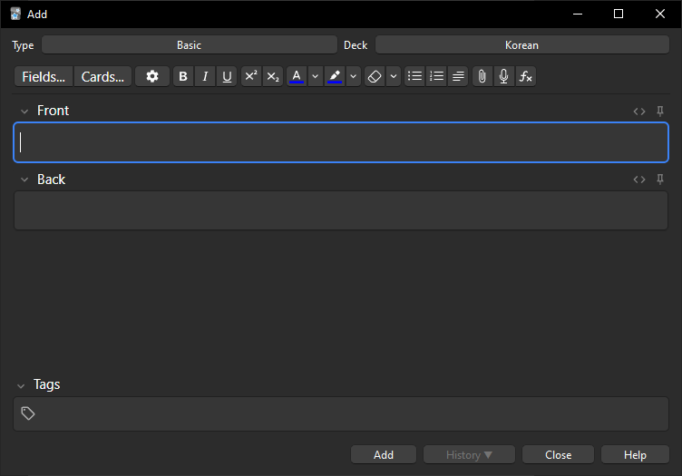
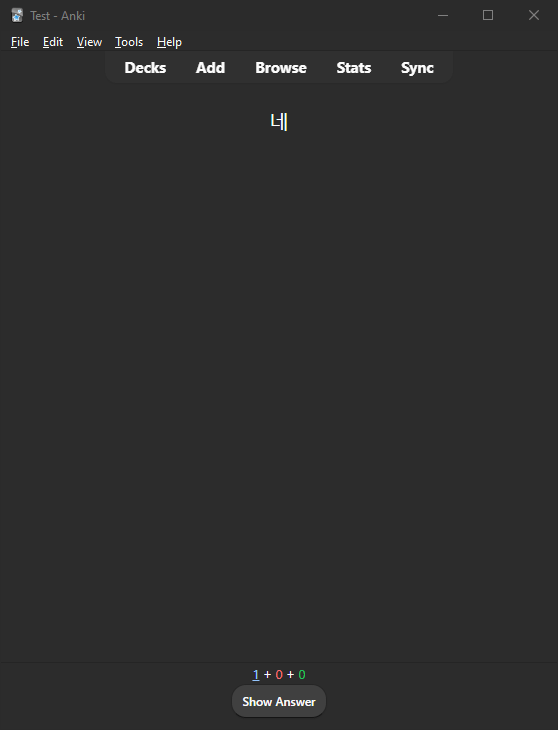
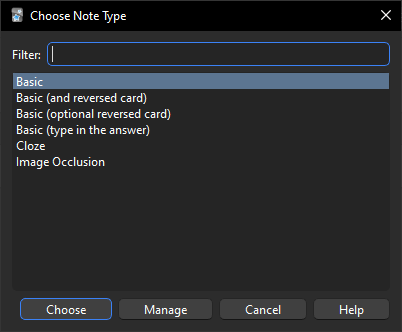

Using flashcards is one of the fastest ways to memorise information. At the beginning of learning a new language it's amazing how beneficial flashcards are.

## Why Anki is amazing
Anki is a digital flashcard app. In Anki you can create your own decks, these decks contain all your flashcards.  
To learn Korean you will want to have cards that have Korean on one side and the English translation on the other. Now when you go through your flashcard deck you will want to know what's on the other side of the card when you see the front.

What makes Anki great is that it combines the following learning concepts:
- Spaced Repetition
- Active Recall
- Interleaving

With Anki you can get insights into your study. It also allows for cross platform synchronization, so you can study on your pc at home or with your phone on the bus. You have a lot of customization options for your flashcards and decks. There are also pre-made decks by others which you can use.

## How to use Anki
Let's get you started on how to use Anki to study.

### Create your first Anki deck
Your Anki will look similar to this when you first start it. Here I am using the desktop version.

Let's create a new deck with the name "Korean".

The "Default" will be replaced by our new deck. Click on the name and then on "Add" on the top.

Here we choose what kind of card we want to add, which deck to add it to and what the content should be like.

For example we add `네` to the front and `Yes` to the back.  
Now we can see that there is a new card in our deck.

Click on your deck to study it. Here you will be reviewing the cards you have added.

Do you know the answer to your card? If yes, press "Good". If not, press "Again". I recommend to mostly use one of these two answers and to ignore "Hard" and "Easy" in the beginning.

If you are using a keyboard you can use `enter`and your numbers keys for quicker navigation. So press `enter` to "Show Answer" and `1` for `Again` or `3` for `Good`. 

### What makes a good flashcard
Most flashcards you will make should test you on one aspect.  
You will remember the content more easily if you connect it to things you already know inside your head, this could be words you already know, pictures, sounds, contexts or anything you can think of. The more vibrant the connection the easier it can be.  
The information should be meaningful. Add content that is relevant to you. You brain is great at optimizing its energy usage, why should it waste energy on meaningless information. Not only will it be really to hard to remember that information, but you also won't gain much benefit from remembering it as well.

Flashcards should be **specific**, **connected** and **meaningful**.

### Different card types
Now if we want to add a card where we want to study both `front -> back` and `back -> front` we don't have to create two cards for this.  
We can instead adjust the card type.

When we create a new card we can see the option `basic` at the top left, click this and you will find more options available.

Most cards you create will either be `Basic` or `Basic (and reversed card)`. The `Basic (type in the answer)` is also nice, here you will be prompted to type in the answer of your card when you see it.

### Synching across devices
The official Anki Manual has a [page explaining how to setup syncing](https://docs.ankiweb.net/syncing.html). But you only really need to create an Anki account. Then log into that account on the devices you want to study Anki on and then let the synchronisation run.

## What is Anki bad at?
Flashcards are great for low-order learning, but not for high-order learning. Low-order learning involves memorization and recall, whereas high-order learning requires deeper understanding, critical thinking, and application.

Don't spend the majority of your time just repeating flashcards, use other learning methods as well.  
Also don't feel like you are forced to use Anki if you don't enjoy it. Give Anki a chance, but after trying multiple times it's okay to not use it or to take breaks from it. There are many polyglots (a person who speaks multiple languages) that successfully learned without using a tool such as Anki.

There are a few common traps you can fall into when using Anki.

Using Anki is not the long-term goal of a language study. People really skilled in a field don't use Anki or flashcards in their daily life to improve that skill. The goal is to reach a certain level to not use Anki anymore.

Another common mistake is memorising the flashcards themselves instead of the underlying information. That is one of the reasons why Anki should never be the only way you learn and practice your target language. You want to be able to use the information you have repeat on the cards in other contexts.

Anki cards can get overwhelming quickly. Limit the amount of cards you have each day.