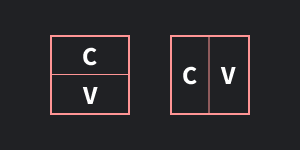
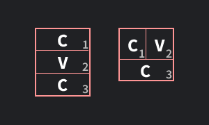

Introduction on reading Hangul, understand the letters of the Korean alphabet.

## Introduction

Being able to read Hangul doesn't take long. There's only about as many different basic "letters" as in the English language. Modern Hangul uses around 24 basic letters.

Hangul is made out of consonants, like ㄱ(g) or ㅁ(m) and vowels like ㅏ(a) or ㅜ(u). To make a sound you need to combine at least 1 consonant and 1 vowel. Each combination is one block.  
To make the sound "ga" you combine them into this block: 가  
Or for "ma": 마  
Or for "mu": 무  

Don't try to represent Korean words in romanized letters (the English alphabet). It is not possible to accurately represent Korean words with letters this way. Understanding Hangul is the fundamental first step to mastering Korean.

## Basic Consonants
The basic consonants of Hangul are: ㄱ, ㄴ, ㄷ, ㄹ, ㅁ, ㅂ, ㅅ, ㅇ, ㅈ, ㅊ, ㅋ, ㅌ, ㅍ, ㅎ

- ㄱ = k/g
- ㄴ = n
- ㄷ = t/d
- ㄹ = r/l
- ㅁ = m
- ㅂ = b/p
- ㅅ = s
- ㅇ = (ng)*
- ㅈ = j/ch
- ㅎ = h

These you will have to memorize. I made a [pre-made Anki deck](/files/ToLearnKoreanHangul.apkg) for you with which you can practice that contains all the flashcards you need to know to memorize Hangul.

**ㄱ** sounds like a mix between "k" and "g".  
**ㄴ** is a "n" sound.  
**ㄷ** is a mix between "t" and "d".  
**ㄹ** is a mix between "r" and "l".  
**ㅁ** is a "m" sound.  
**ㅂ** is a mix between "b" and "p".  
**ㅅ** is a "s" sound.  
**ㅇ** is a special case. At the beginning of a syllable / block is has no sound, at the end it sounds like "ng". More on what this means down below.  
**ㅈ** is a mix between "j" and "ch". Like the "ch" sound from the word "chair".

Writing and memorizing these at the beginning is hard. It's normal to only be able to read very slowly and feel like an elementary school kid. But with practice you will get better.

Korean learners often struggle with "ㄹ" as it can be a bit harder to pronounce. It's also the reason why many Koreans struggle to differentiate the sounds of "r" and "l", since it is a single letter that can sound like both of these. To make this sound move your tongue to the position as if you were going to pronounce "d" (like "da") but instead say "la". [This video explains it well](https://youtu.be/2-4ShB33Eu4), but when you are starting out don't stress too much about sounding perfect.

## Basic Vowels
Next let's focus on the following vowels:ㅏ, ㅓ, ㅗ, ㅜ, ㅡ, ㅣ
- ㅏ = a
- ㅓ = eo (sounds more like "uh")
- ㅗ = o
- ㅜ = u
- ㅡ = eu
- ㅣ = i

Combined with the consonant "ㄱ" they sound like this: 가("ga"), 거("geo"), 고("go"), 구("gu"), 그("geu"), 기("gi").  
Combined with the consonant "ㄷ" they sound like this: 다("da"), 더("deo"), 도("do"), 두("du"), 드("deu"), 디("di").

## Building Blocks
To make a sound in Korean you need at least 1 consonant and 1 vowel.

|       | **ㄱ** | **ㄴ** | **ㄷ** | **ㄹ** | **ㅁ** | **ㅂ** | **ㅅ** | **ㅇ** | **ㅈ** | **ㅎ** |
| ----- | ----- | ----- | ----- | ----- | ----- | ----- | ----- | ----- | ----- | ----- |
| **ㅏ** | 가     | 나     | 다     | 라     | 마     | 바     | 사     | 아     | 자     | 하     |
| **ㅓ** | 거     | 너     | 더     | 러     | 머     | 버     | 서     | 어     | 저     | 허     |
| **ㅗ** | 고     | 노     | 도     | 로     | 모     | 보     | 소     | 오     | 조     | 호     |
| **ㅜ** | 구     | 누     | 두     | 루     | 무     | 부     | 수     | 우     | 주     | 후     |
| **ㅡ** | 그     | 느     | 드     | 르     | 므     | 브     | 스     | 으     | 즈     | 흐     |
| **ㅣ** | 기     | 니     | 디     | 리     | 미     | 비     | 시*    | 이     | 지     | 히     |

**special pronunciation case*

There are two ways blocks that contain 1 consonant and 1 vowel are built, either horizontally or vertically.

(C: consonant; V: vowel)

How the block is built depends on the vowel, vertically with (ㅏ, ㅓ, ㅣ) or horizontally with (ㅗ, ㅜ, ㅡ).

Words in Korean can look like this:  
아기(agi): Baby  
고기(go-gi): Meat  
가방 (ga-bang): Backpack  
사람(sa-ram): Person  
물(mul): Water  
손가락(son-ga-rak): Finger  

As you can see there are more ways to build blocks, like when you have 2 consonants.

The numbers in the corner indicate in which order you read them. You read them left to right and then top to bottom, as would feel natural for the English language as well, so there shouldn't be any surprises.

We can also see here how the character "ㅇ" works. At the beginning of a word such as "아기" it has no sound. It's only there as a filler to make the sound "a", since the vowel "ㅏ" can't be used alone without any consonant.  
At the end of a block "ㅇ" becomes a "ng" sound, like in "가방".  
Or like in 응급 ("eunggeup" which means emergency), the first "ㅇ" has no sound but the second "ㅇ" sounds like "ng".

That is almost all when it comes to building these blocks and their pronunciation. There are some cases where you have blocks with 4 symbols, these often follow some special pronunciation rule for their last two characters so I will go into them in a later lesson.

In the next lesson we will cover the remaining consonants and vowels. Luckily these are quite similar to the ones we already know now.

---

Sources & References

- [Learn Hangul in 90 Minutes by BillyGo](https://youtu.be/s5aobqyEaMQ) (youtube video)
- [Learn how to read Hangul by howtostudykorean](https://www.howtostudykorean.com/unit0/) (website text)
- [Learn Hangul 한글 (Korean Alphabet) by Miss Vicky](https://youtu.be/85qJXvyFrIc) (youtube video)

Planned improvements to this page

- Short note on how to remember more easily (create fun images / references / stories)
- Audio

